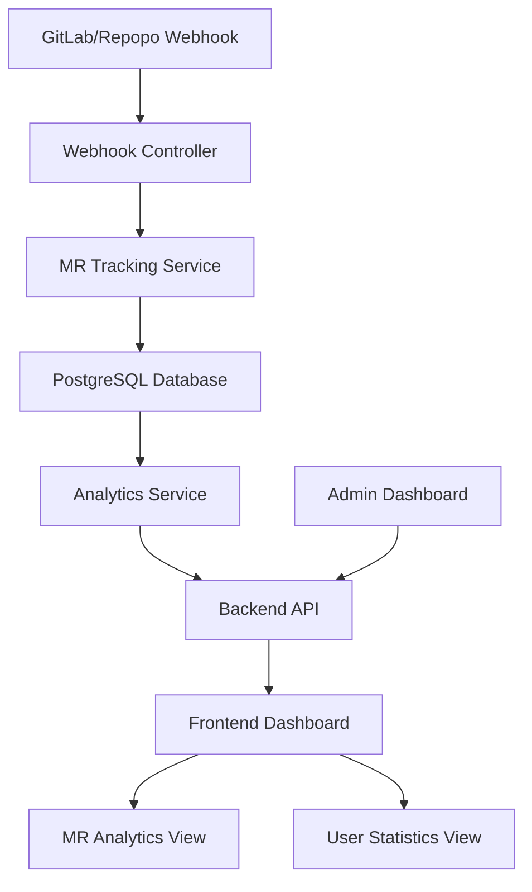
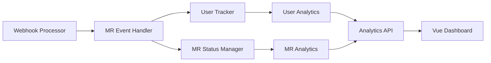
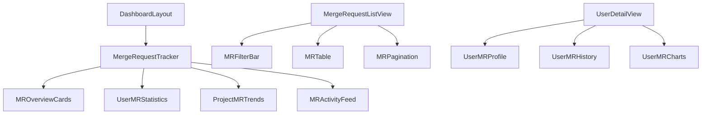

# Merge Request Tracker Design

## Overview

The Merge Request Tracker is an enhancement to the existing Code-Agent system that provides comprehensive tracking and analytics for user merge request activities on the Repopo (GitLab self-hosted) platform. This feature will monitor merge request creation, status changes, and completion rates while providing detailed user analytics through both backend APIs and frontend dashboard components.

## Architecture

### Data Flow Architecture



### Component Integration



## Backend Architecture

### Database Schema

#### Merge Request Tracking Table
```sql
CREATE TABLE merge_request_tracking (
  id SERIAL PRIMARY KEY,
  project_id INTEGER NOT NULL,
  merge_request_iid INTEGER NOT NULL,
  merge_request_id INTEGER NOT NULL,
  title TEXT NOT NULL,
  description TEXT,
  author_id INTEGER NOT NULL,
  author_username TEXT NOT NULL,
  author_name TEXT,
  source_branch TEXT NOT NULL,
  target_branch TEXT NOT NULL,
  status TEXT NOT NULL, -- opened, merged, closed, locked
  action TEXT NOT NULL, -- open, update, close, merge, reopen
  created_at TIMESTAMP WITH TIME ZONE NOT NULL,
  updated_at TIMESTAMP WITH TIME ZONE DEFAULT NOW(),
  merged_at TIMESTAMP WITH TIME ZONE,
  closed_at TIMESTAMP WITH TIME ZONE,
  merge_commit_sha TEXT,
  repository_url TEXT,
  web_url TEXT,
  is_repopo_event BOOLEAN DEFAULT FALSE,
  repopo_token TEXT,
  UNIQUE(project_id, merge_request_iid)
);

CREATE INDEX idx_mr_tracking_author ON merge_request_tracking(author_username);
CREATE INDEX idx_mr_tracking_project ON merge_request_tracking(project_id);
CREATE INDEX idx_mr_tracking_status ON merge_request_tracking(status);
CREATE INDEX idx_mr_tracking_created_at ON merge_request_tracking(created_at);
```

#### User MR Statistics Table
```sql
CREATE TABLE user_mr_statistics (
  id SERIAL PRIMARY KEY,
  user_id INTEGER NOT NULL,
  username TEXT NOT NULL,
  project_id INTEGER NOT NULL,
  total_mrs_created INTEGER DEFAULT 0,
  total_mrs_merged INTEGER DEFAULT 0,
  total_mrs_closed INTEGER DEFAULT 0,
  total_mrs_rejected INTEGER DEFAULT 0,
  avg_merge_time_hours DECIMAL(10,2),
  last_mr_created_at TIMESTAMP WITH TIME ZONE,
  last_mr_merged_at TIMESTAMP WITH TIME ZONE,
  created_at TIMESTAMP WITH TIME ZONE DEFAULT NOW(),
  updated_at TIMESTAMP WITH TIME ZONE DEFAULT NOW(),
  UNIQUE(user_id, project_id)
);

CREATE INDEX idx_user_mr_stats_username ON user_mr_statistics(username);
CREATE INDEX idx_user_mr_stats_project ON user_mr_statistics(project_id);
```

### API Endpoints

#### Merge Request Tracking Endpoints

```typescript
// GET /api/merge-requests
interface MergeRequestListParams {
  page?: number;
  limit?: number;
  project_id?: number;
  author_username?: string;
  status?: 'opened' | 'merged' | 'closed';
  from_date?: string;
  to_date?: string;
}

// GET /api/merge-requests/:id
interface MergeRequestDetails {
  id: number;
  project_id: number;
  merge_request_iid: number;
  title: string;
  description: string;
  author: UserInfo;
  source_branch: string;
  target_branch: string;
  status: string;
  created_at: string;
  updated_at: string;
  merged_at?: string;
  merge_time_hours?: number;
  repository_url: string;
  web_url: string;
}
```

#### User Analytics Endpoints

```typescript
// GET /api/users/:username/mr-statistics
interface UserMRStatistics {
  username: string;
  projects: ProjectMRStats[];
  overall: {
    total_mrs_created: number;
    total_mrs_merged: number;
    total_mrs_closed: number;
    success_rate: number;
    avg_merge_time_hours: number;
  };
}

// GET /api/analytics/merge-requests
interface MRAnalytics {
  total_mrs: number;
  mrs_by_status: StatusBreakdown;
  mrs_by_user: UserBreakdown[];
  mrs_by_project: ProjectBreakdown[];
  merge_time_trends: TimeSeriesData[];
  daily_mr_creation: TimeSeriesData[];
}
```

### Service Layer Architecture

#### MR Tracking Service
```typescript
class MergeRequestTrackingService {
  async trackMergeRequestEvent(event: GitLabMergeRequestEvent): Promise<void>
  async updateMergeRequestStatus(mrId: number, status: string): Promise<void>
  async getMergeRequestsByUser(username: string): Promise<MergeRequestDetails[]>
  async getMergeRequestsByProject(projectId: number): Promise<MergeRequestDetails[]>
  async calculateUserStatistics(username: string): Promise<UserMRStatistics>
}
```

#### Analytics Service Enhancement
```typescript
class AnalyticsService {
  async getMergeRequestAnalytics(filters: AnalyticsFilters): Promise<MRAnalytics>
  async getUserMergeRequestStats(username: string): Promise<UserMRStatistics>
  async getProjectMergeRequestTrends(projectId: number): Promise<ProjectTrends>
  async generateMergeRequestReport(params: ReportParams): Promise<ReportData>
}
```

### Webhook Enhancement

#### Enhanced Webhook Processing
```typescript
// Enhanced webhook controller for MR tracking
async function processMergeRequestEvent(event: GitLabMergeRequestEvent) {
  const isRepopo = isRepopoWebhook(req);
  
  const trackingData = {
    project_id: event.project.id,
    merge_request_iid: event.object_attributes.iid,
    merge_request_id: event.object_attributes.id,
    title: event.object_attributes.title,
    description: event.object_attributes.description,
    author_id: event.object_attributes.author_id,
    author_username: event.user.username,
    author_name: event.user.name,
    source_branch: event.object_attributes.source_branch,
    target_branch: event.object_attributes.target_branch,
    status: event.object_attributes.state,
    action: event.object_attributes.action,
    created_at: event.object_attributes.created_at,
    updated_at: event.object_attributes.updated_at,
    merged_at: event.object_attributes.merged_at,
    closed_at: event.object_attributes.closed_at,
    merge_commit_sha: event.object_attributes.merge_commit_sha,
    repository_url: event.project.web_url,
    web_url: event.object_attributes.url,
    is_repopo_event: isRepopo,
    repopo_token: isRepopo ? extractRepopoToken(req) : null
  };
  
  await mergeRequestTrackingService.trackMergeRequestEvent(trackingData);
  await userStatisticsService.updateUserStatistics(event.user.username, event.project.id);
}
```

## Frontend Architecture

### Component Hierarchy



### Vue Components

#### MR Overview Dashboard Component
```vue
<template>
  <div class="mr-tracker-dashboard">
    <!-- Statistics Cards -->
    <div class="grid grid-cols-1 gap-5 sm:grid-cols-2 lg:grid-cols-4 mb-8">
      <StatCard 
        title="Total MRs Created"
        :value="mrStats.totalCreated"
        icon="plus-circle"
        color="primary"
      />
      <StatCard 
        title="MRs Merged"
        :value="mrStats.totalMerged"
        icon="check-circle"
        color="success"
      />
      <StatCard 
        title="Success Rate"
        :value="`${mrStats.successRate}%`"
        icon="trending-up"
        color="info"
      />
      <StatCard 
        title="Avg Merge Time"
        :value="`${mrStats.avgMergeTime}h`"
        icon="clock"
        color="warning"
      />
    </div>

    <!-- Charts Section -->
    <div class="grid grid-cols-1 lg:grid-cols-2 gap-6 mb-8">
      <MRTrendChart :data="trendData" />
      <UserActivityChart :data="userActivityData" />
    </div>

    <!-- Recent Activity -->
    <MRActivityFeed :activities="recentActivities" />
  </div>
</template>
```

#### User MR Statistics Component
```vue
<template>
  <div class="user-mr-statistics">
    <div class="card">
      <div class="card-header">
        <h3>User Merge Request Statistics</h3>
        <UserSearchInput v-model="selectedUser" @search="fetchUserStats" />
      </div>
      
      <div v-if="userStats" class="card-body">
        <UserMRProfile :user="userStats" />
        <UserMRMetrics :metrics="userStats.overall" />
        <UserProjectBreakdown :projects="userStats.projects" />
      </div>
    </div>
  </div>
</template>
```

#### MR List View Component
```vue
<template>
  <div class="mr-list-view">
    <div class="card">
      <div class="card-header">
        <h3>Merge Requests</h3>
        <MRFilterBar 
          v-model:filters="filters"
          @filter-change="fetchMergeRequests"
        />
      </div>
      
      <MRTable 
        :merge-requests="mergeRequests"
        :loading="loading"
        @sort="handleSort"
      />
      
      <BasePagination 
        v-model:page="currentPage"
        :total-pages="totalPages"
        @page-change="fetchMergeRequests"
      />
    </div>
  </div>
</template>
```

### State Management

#### MR Store (Pinia)
```typescript
export const useMergeRequestStore = defineStore('mergeRequests', () => {
  const mergeRequests = ref<MergeRequestDetails[]>([])
  const mrStatistics = ref<MRAnalytics | null>(null)
  const userStatistics = ref<Map<string, UserMRStatistics>>(new Map())
  const loading = ref(false)
  const error = ref<string | null>(null)

  const fetchMergeRequests = async (filters: MergeRequestFilters) => {
    loading.value = true
    try {
      const response = await mergeRequestApi.getMergeRequests(filters)
      if (response.success) {
        mergeRequests.value = response.data
      }
    } finally {
      loading.value = false
    }
  }

  const fetchUserStatistics = async (username: string) => {
    const response = await mergeRequestApi.getUserStatistics(username)
    if (response.success) {
      userStatistics.value.set(username, response.data)
    }
  }

  const fetchMRAnalytics = async (filters: AnalyticsFilters) => {
    const response = await analyticsApi.getMergeRequestAnalytics(filters)
    if (response.success) {
      mrStatistics.value = response.data
    }
  }

  return {
    mergeRequests,
    mrStatistics,
    userStatistics,
    loading,
    error,
    fetchMergeRequests,
    fetchUserStatistics,
    fetchMRAnalytics
  }
})
```

### Routing Configuration

```typescript
// Enhanced router configuration
const routes = [
  {
    path: '/merge-requests',
    name: 'MergeRequests',
    component: () => import('@/views/MergeRequestsView.vue'),
    meta: { requiresAuth: true }
  },
  {
    path: '/merge-requests/analytics',
    name: 'MRAnalytics',
    component: () => import('@/views/MRAnalyticsView.vue'),
    meta: { requiresAuth: true }
  },
  {
    path: '/users/:username/merge-requests',
    name: 'UserMRStatistics',
    component: () => import('@/views/UserMRView.vue'),
    meta: { requiresAuth: true }
  }
]
```

## Data Models & Interfaces

### TypeScript Interfaces

```typescript
interface MergeRequestDetails {
  id: number;
  project_id: number;
  merge_request_iid: number;
  merge_request_id: number;
  title: string;
  description: string;
  author: {
    id: number;
    username: string;
    name: string;
  };
  source_branch: string;
  target_branch: string;
  status: 'opened' | 'merged' | 'closed' | 'locked';
  action: 'open' | 'update' | 'close' | 'merge' | 'reopen';
  created_at: string;
  updated_at: string;
  merged_at?: string;
  closed_at?: string;
  merge_time_hours?: number;
  repository_url: string;
  web_url: string;
  is_repopo_event: boolean;
}

interface UserMRStatistics {
  username: string;
  user_id: number;
  projects: ProjectMRStats[];
  overall: {
    total_mrs_created: number;
    total_mrs_merged: number;
    total_mrs_closed: number;
    total_mrs_rejected: number;
    success_rate: number;
    avg_merge_time_hours: number;
    last_mr_created_at?: string;
    last_mr_merged_at?: string;
  };
}

interface ProjectMRStats {
  project_id: number;
  project_name: string;
  total_mrs_created: number;
  total_mrs_merged: number;
  success_rate: number;
  avg_merge_time_hours: number;
}

interface MRAnalytics {
  total_mrs: number;
  mrs_by_status: {
    opened: number;
    merged: number;
    closed: number;
  };
  mrs_by_user: UserBreakdown[];
  mrs_by_project: ProjectBreakdown[];
  merge_time_trends: TimeSeriesData[];
  daily_mr_creation: TimeSeriesData[];
  repopo_vs_gitlab: {
    repopo_count: number;
    gitlab_count: number;
  };
}
```

## API Integration Layer

### Enhanced API Client

```typescript
// Merge Request API methods
export const mergeRequestApi = {
  getMergeRequests: (params: MergeRequestListParams): Promise<ApiResponse<MergeRequestDetails[]>> =>
    apiClient.get<MergeRequestDetails[]>('/merge-requests', params),

  getMergeRequest: (id: number): Promise<ApiResponse<MergeRequestDetails>> =>
    apiClient.get<MergeRequestDetails>(`/merge-requests/${id}`),

  getUserStatistics: (username: string): Promise<ApiResponse<UserMRStatistics>> =>
    apiClient.get<UserMRStatistics>(`/users/${username}/mr-statistics`),

  getMRAnalytics: (filters?: AnalyticsFilters): Promise<ApiResponse<MRAnalytics>> =>
    apiClient.get<MRAnalytics>('/analytics/merge-requests', filters),

  exportMRReport: (filters: ReportFilters): Promise<string> =>
    apiClient.getRaw('/merge-requests/export', filters, { responseType: 'text' })
}
```

## Implementation Phases

### Phase 1: Database Schema & Core Tracking
- Add MR tracking tables to `database.ts` `initializeSchema()` method
- Implement database methods following existing patterns
- Enhance webhook processing in `webhook.ts` for MR event capture
- Add Repopo token extraction and detection
- Test with existing database health check script

### Phase 2: Backend API Integration
- Add MR tracking endpoints to existing admin controllers
- Enhance analytics controller to include MR metrics
- Follow existing SQL injection protection patterns
- Implement pagination and filtering following `admin-reviews.ts` patterns
- Add CSV export functionality

### Phase 3: Frontend Dashboard Enhancement
- Enhance existing analytics dashboard with MR metrics cards
- Add MR tracking section to current dashboard layout
- Integrate with existing Pinia stores (analytics, reviews)
- Follow current Vue component patterns and Tailwind styling
- Add user MR statistics view to existing user management